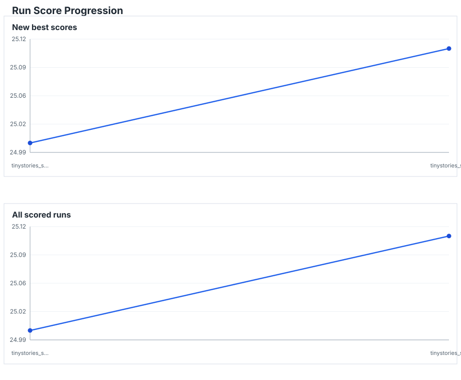

# LM Research

A small JAX/Flax NNX opinionated language-model research repo focused on reproducible experiments, fast iteration, and easy inspection when training behavior looks strange. Goal: Best model trained with only 2B tokens.

## What It Does

- Trains a decoder-only language model.
- Uses JAX + Flax NNX for the model and training step.
- Uses Optax Muon for hidden 2D matrices, with vocab matrices routed to AdamW.
- Uses Grain for deterministic data loading and checkpointable train iteration.
- Supports local text data and offline prepared token datasets from Hugging Face.
- Logs local run artifacts first: metrics, batch provenance, samples, configs, and checkpoints.
- Optionally mirrors scalar metrics and generated samples to W&B.

Local artifacts are the source of truth. W&B is only a dashboard and comparison layer.



## Setup

Install dependencies with uv:

```bash
uv sync
```

The smoke config expects Tiny Shakespeare at:

```text
data/tiny_shakespeare/input.txt
```

One way to download it:

```bash
mkdir -p data/tiny_shakespeare
curl -L https://raw.githubusercontent.com/karpathy/char-rnn/master/data/tinyshakespeare/input.txt \
  -o data/tiny_shakespeare/input.txt
```

## Configs

Experiment configs live in `configs/` so the repo root stays clean. The default smoke run is:

```text
configs/smoke.toml
```

Main sections:

- `[experiment]`: run name and output directory
- `[model]`: model size, heads, context length, RoPE theta
- `[precision]`: compute, parameter, and loss dtypes
- `[distributed]`: replicated data-parallel device mesh settings
- `[profiling]`: lightweight timing and future profiler capture settings
- `[train]`: batch size, steps, peak learning rate, eval/checkpoint cadence
- `[train.lr_schedule]`: optional LR schedule; defaults to linear warmup + cosine decay
- `[data]`: either raw text data or prepared token data
- `[sampling]`: optional deterministic prompt sampling during eval
- `[wandb]`: optional online logging

Learning-rate schedules are step-based. `train.lr` is the peak LR. If
`[train.lr_schedule]` is omitted, training uses cosine decay with
`warmup_ratio = 0.01` and `min_lr_ratio = 0.1`.

Cosine schedule:

```toml
[train.lr_schedule]
type = "cosine"
warmup_ratio = 0.01
min_lr_ratio = 0.1
```

Warmup-stable-decay schedule:

```toml
[train.lr_schedule]
type = "wsd"
warmup_ratio = 0.01
stable_ratio = 0.80
min_lr_ratio = 0.1
```

Precision config:

```toml
[precision]
compute_dtype = "bf16"
param_dtype = "fp32"
loss_dtype = "fp32"
```

Supported dtype names are `fp32` and `bf16`. The intended mixed-precision path
uses bf16 forward compute with fp32 parameters and fp32 cross entropy.

Distributed config:

```toml
[distributed]
enabled = true
device_count = "auto"
axis_name = "data"
```

Training uses one replicated data-parallel path for 1 or more local devices. (For our model size, comms cost for more complex distributed setups need to be tested to see if its worth it.)
Model parameters and optimizer state are replicated, and batch arrays are
sharded over the `axis_name` mesh axis. `train.batch_size` is always the global
batch size, so it must divide evenly by the selected device count. Use
`device_count = "auto"` to use all visible JAX devices, or set a positive
integer to use a prefix of local devices.

Profiling config:

```toml
[profiling]
enabled = false
profiler = "none"
start_step = 100
steps = 5
output_dir = "profiles"
```

Phase 1 profiling is always-on lightweight timing. Training logs detailed
breakdowns such as `time/data_sec`, `time/shard_sec`,
`time/train_step_sec`, `time/eval_sec`, `time/checkpoint_sec`, and
`time/train_tokens_per_sec` to `metrics.jsonl` and W&B. The console keeps the
compact metrics table.
JAX dispatch is asynchronous, so `time/train_step_sec` mostly measures enqueue
time; `time/metrics_sync_sec` is the explicit host synchronization point for
logged scalars and may include queued device work.

Training also logs always-on health metrics to `metrics.jsonl` and W&B without
adding console columns. These include `train/bpb`, `val/bpb`,
`optim/loss_scale`, `health/train_val_gap`, rolling loss slopes, loss and grad
norm spike flags/counts, `health/nan_count`, `health/grad_param_ratio`,
`health/spike_rate`, and `time/elapsed_sec`. BPB is computed from token negative log likelihood
normalized by target-token UTF-8 bytes.

For a short JAX trace, enable profiling and set `profiler = "jax"`. Trace
files are written under `runs/<name>/profiles/jax_trace/`. For Nsight Systems,
set `profiler = "nsys"` so the training loop emits NVTX ranges without starting
the JAX profiler; JAX and NSys should not capture CUPTI in the same process.

## Data

Raw text configs use a single local text file and split tokens deterministically:

```toml
[data]
source = "text"
path = "data/tiny_shakespeare/input.txt"
tokenizer = "gpt2"
val_fraction = 0.1
```

Prepared token configs read offline `.bin` files with `np.memmap`:

```toml
[data]
source = "tokens"
path = "data/tinystories_gpt2"
tokenizer = "gpt2"
```

Prepared token directories contain:

```text
data/<name>/
  tokens.bin
  manifest.json
```

To prepare a Hugging Face dataset once, then train fully offline:

```bash
uv run prepare-data configs/data/tinystories.toml
```

The prep step tokenizes the dataset once, streams input texts into one `uint32`
`tokens.bin`, inserts EOT between documents by default, and records train/val
split offsets plus source/tokenizer metadata in `manifest.json`. For HF datasets,
`prepare-data` uses `HF_TOKEN` or `HUGGING_FACE_HUB_TOKEN` if set, then falls
back to saved Hugging Face Hub credentials from `hf auth login`, and only prompts
if no token is available. Blank prompt input uses anonymous downloads. Tokens are
never written to the manifest.

Prepared token manifests are validated on load: dtype, tokenizer name, token file
length, train/val split bounds, and split overlap must match the config and token
file. Checksum validation is available in code but not run by default, so large
training starts do not hash multi-GB token files.
Prepared data also stores `token_bytes.bin`, a tokenizer byte-length lookup used
for BPB metrics. Older prepared datasets without this file still work; the table
is regenerated from the tokenizer at startup.

### Domain Validation

Domain validation data is a shared artifact prepared once per tokenizer. The
domain pack path is tokenizer-derived by default:

```text
data/eval_domains/<tokenizer>/
```

For example, `tokenizer.name = "gpt2"` uses:

```text
data/eval_domains/gpt2/
```

Training and checkpoint evals require this pack and infer the path from
`[data].tokenizer` unless `[eval].domain_root` overrides it. The v1 domain panel
is fixed:

```text
web, knowledge, books, news, code, math, reasoning, docs, dialogue
```

The reusable eval source panel lives in `configs/data/eval_domains.toml`.
Prepare it before launching runs:

```bash
uv run prepare-data configs/data/eval_domains.toml
```

The normal workflow is:

```bash
uv run prepare-data configs/data/eval_domains.toml
uv run prepare-data configs/data/tinystories.toml
uv run experiment configs/your_experiment.toml
```

The first command writes `data/eval_domains/gpt2/`. The second writes
`data/tinystories_gpt2/`. Pretraining infers the eval pack path from
`[data].tokenizer`, unless `[eval].domain_root` overrides it.

Training logs `val/domain/<domain>/loss`, `ppl`, `bpb`, and `tokens` to
`metrics.jsonl` and W&B; the console table stays compact.

## Run Training

```bash
uv run pretrain configs/smoke.toml
```

Startup prints the run summary, initializes optional W&B logging, then compiles the first JAX step before printing the metrics table.

A run writes to:

```text
runs/<experiment.name>/
```

Important files:

- `config.toml`: copied config used for that run
- `metadata.json`: environment metadata
- `metrics.jsonl`: scalar metrics
- `batches.jsonl`: per-step batch provenance
- `samples/`: generated samples and inspected batch text
- `checkpoints/`: Orbax checkpoints with model, optimizer, metadata, and Grain iterator state

`checkpoint_every` controls periodic checkpoints. Successful training also
writes a final checkpoint at `train.steps` when the cadence did not already save
one, so post-training evals target the completed model state.

If the run directory already exists, startup fails by design. Use a new `[experiment].name` or resume.

## Count Parameters

Use `param-count` to size model configs before launching a run:

```bash
uv run param-count configs/smoke.toml
```

You can override individual dimensions from a config:

```bash
uv run param-count configs/smoke.toml --hidden-size 768 --layers 12 --heads 12 --kv-heads 4
```

Or provide the model shape directly:

```bash
uv run param-count \
  --vocab-size 50257 \
  --hidden-size 768 \
  --intermediate-size 2048 \
  --layers 12 \
  --heads 12 \
  --kv-heads 4 \
  --seq-len 2048
```

The report includes total parameters plus splits for token embeddings, LM head, attention, MLP, and norms.

## Plan Training Budget

Use `train-budget` to convert config batch shape into steps, tokens, and approximate epochs:

```bash
uv run train-budget configs/smoke.toml --tokens 2000000000
```

The utility always reports `tokens_per_step`, configured steps, and configured tokens. For prepared token datasets, it reads `manifest.json` and also reports train tokens, steps per epoch, usable epoch tokens, and configured/target epochs:

Use a prepared-token experiment config to report dataset-derived epoch counts.

Raw text configs do not infer dataset token counts; pass `--tokens` when you only need target-step math.

## Profile A Run

Use `profile` to summarize timing metrics from a completed run:

```bash
uv run profile runs/<run_name>
# equivalent:
uv run profile summary runs/<run_name>
```

The command reads `metrics.jsonl`, skips the first 20 steps by default, prints
mean/p50/p95/max timing tables, and writes:

```text
runs/<name>/profiles/timing_summary.json
runs/<name>/profiles/timing_summary.md
```

Use `--warmup-steps` to choose a different cutoff.

Use `profile analyze` to write a compact LLM-readable report from timing metrics
and an optional NSys report:

```bash
uv run profile analyze runs/<run_name>
```

The command writes:

```text
runs/<name>/profiles/profile_report.json
runs/<name>/profiles/profile_report.md
```

To capture a short JAX trace, use a short timing-style config with:

```toml
[profiling]
enabled = true
profiler = "jax"
start_step = 100
steps = 5
output_dir = "profiles"
```

For Nsight Systems, use `profiler = "nsys"` instead. This emits NVTX ranges for
the same phase names without starting the JAX profiler:

```toml
[profiling]
enabled = true
profiler = "nsys"
start_step = 100
steps = 5
output_dir = "profiles"
```

Then launch the run through the `profile` helper:

```bash
uv run profile nsys configs/your_experiment.toml --force-run-dir
```

The helper writes the temporary NSys report outside `runs/`, lets `pretrain`
create the run directory normally, and copies the final report to
`runs/<name>/profiles/nsys.nsys-rep`.
Add `--analyze` to generate `profile_report.json` and `profile_report.md`
after a successful NSys capture.

## Resume

```bash
uv run pretrain configs/smoke.toml --resume
```

Resume restores the latest checkpoint and Grain iterator state, then continues from the saved next step.

## Evaluate A Checkpoint

Use `eval-checkpoint` to run the configured validation split against a saved
checkpoint without restoring the optimizer or train iterator:

```bash
uv run eval-checkpoint runs/tiny_shakespeare_smoke
uv run eval-checkpoint runs/tiny_shakespeare_smoke --step 100
uv run eval-checkpoint runs/tiny_shakespeare_smoke --eval-steps 50
```

The command writes:

```text
runs/<name>/evals/step_<step>/metrics.json
runs/<name>/evals/step_<step>/summary.md
```

## Evaluate CORE

Use `eval-core` to run nanochat's CORE benchmark against a saved checkpoint:

```bash
uv run eval-core runs/tiny_shakespeare_smoke
uv run eval-core runs/tiny_shakespeare_smoke --step 100
uv run eval-core runs/tiny_shakespeare_smoke --max-per-task 100
uv run eval-core runs/tiny_shakespeare_smoke --max-per-task 5 --inference-bench
```

The command downloads `eval_bundle.zip` into `data/eval_bundle` if needed, then
writes:

```text
runs/<name>/evals/step_<step>/core_metrics.json
runs/<name>/evals/step_<step>/core.csv
runs/<name>/evals/step_<step>/core_summary.md
runs/<name>/evals/step_<step>/inference_metrics.json
runs/<name>/evals/step_<step>/inference_summary.md
```

Full CORE runs include the inference benchmark by default. Partial CORE runs skip
it unless `--inference-bench` is passed. The current inference benchmark uses
the repo's simple KV-cache decode path.

## Run An Experiment

Use `experiment` when a run should enter the comparison ladder:

```bash
uv run experiment configs/your_experiment.toml
```

This command runs pretraining, checkpoint validation, full CORE plus inference,
then writes a baseline-relative score into the registry. Scoring requires the
checkpoint validation, CORE, and inference artifacts to match the final completed
training step; stale eval artifacts fail before registration. The first scored
run in the registry becomes the baseline by default and scores around `25`;
later runs are scored relative to it. To force a different baseline:

```bash
uv run experiment configs/your_experiment.toml --baseline-run runs/baseline_name
```

The local registry chart is regenerated at:

```text
runs/registry.html
```

The README chart above is regenerated at:

```text
docs/run_score_progression.svg
```

## Summarize A Run

Successful training runs automatically write:

```text
runs/<name>/summary/run_summary.json
runs/<name>/summary/scorecard.md
```

Regenerate the summary manually for old, partial, or newly evaluated runs:

```bash
uv run summarize-run runs/tiny_shakespeare_smoke
```

Register runs explicitly when you want them in the comparison registry:

```bash
uv run summarize-run runs/tiny_shakespeare_smoke --register
uv run register-run runs/tiny_shakespeare_smoke
uv run list-runs
```

The registry is written to `runs/registry.jsonl`.

## Inspect A Training Batch

Every training step logs token spans to `batches.jsonl`, so a suspicious metric spike can be traced back to the exact data seen at that step.

```bash
uv run inspect-batch runs/tiny_shakespeare_smoke 84
```

This writes:

```text
runs/tiny_shakespeare_smoke/samples/batch_step_000084.txt
```

You can also choose the output path:

```bash
uv run inspect-batch runs/tiny_shakespeare_smoke 84 runs/tiny_shakespeare_smoke/samples/my_batch.txt
```

## W&B

Enable W&B in a config file, for example `configs/smoke.toml`:

```toml
[wandb]
enabled = true
project = "data-research"
entity = ""
tags = []
```

If `WANDB_API_KEY` is set or W&B already has saved credentials, training starts without prompting. Otherwise, startup asks for the W&B API key.

W&B receives scalar metrics and a text table of generated samples. Local files are still written either way.

## Tests

```bash
uv run pytest -q
```

To exercise fake 4-device CPU sharding locally:

```bash
XLA_FLAGS=--xla_force_host_platform_device_count=4 JAX_PLATFORMS=cpu uv run pytest tests/test_distributed.py -q
```

Compile check:

```bash
uv run python -m py_compile config.py data.py distributed.py kv_cache.py model.py prepare_data.py pretrain.py logs.py profiling.py checkpoint.py sample.py lr_schedule.py utils/inspect_batch.py utils/param_count.py utils/train_budget.py
```
