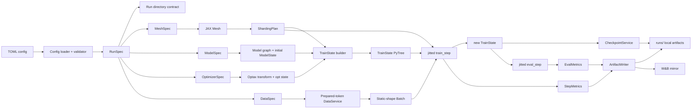
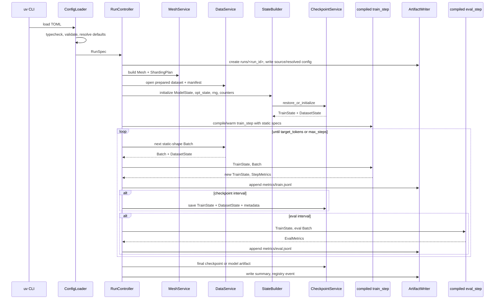

# Jaxtitan architecture proposal

## Executive recommendation

Jaxtitan should borrow TorchTitan’s **separation of responsibilities**, not its PyTorch runtime shape. The core move is:

**TorchTitan:** mutable `Trainer` object wires model, dataloader, optimizer, distributed wrappers, metrics, checkpointing, and profiling.

**Jaxtitan:** host-side `RunController` wires services, but all device-relevant training state is an explicit PyTree passed through stable compiled functions:

```text
TrainState + Batch + static StepSpec
        -> jitted train_step
        -> TrainState + StepMetrics
```

That makes Jaxtitan feel native to JAX: explicit state, explicit RNG, explicit sharding, stable shapes, host-side artifacts, and no hidden mutable training state.

---

# 1. TorchTitan architecture analysis

## 1.1 What problems TorchTitan solves

TorchTitan is a PyTorch-native generative-model training platform whose stated goals are understandability, extensibility, minimal model-code changes when applying multidimensional parallelism, and a clean/minimal codebase with reusable components. Its current README highlights FSDP2, tensor parallelism, pipeline parallelism, context parallelism, meta-device initialization, activation checkpointing, distributed checkpointing, `torch.compile`, Float8/MXFP8, DDP/HSDP, TorchFT, checkpointable dataloading, gradient accumulation, metrics, profiling/debugging, structured logging, and config selection through a Python config registry with `--module` and `--config`. ([GitHub][1])

The important architectural problem is not “how to train Llama 3.1,” but **how to keep model definition, parallelism application, and training lifecycle mostly orthogonal**. The TorchTitan paper explicitly describes its code organization as three separated pieces: a parallelism-agnostic readable model definition, model-specific parallelism helpers, and a generalized training loop; it also emphasizes configurable composition of model and parallelism techniques. ([arXiv][2])

For Jaxtitan, this translates to:

```text
model code        should not know the run loop
training state    should not know host services
host services     should not be inside jit
sharding choices  should be explicit specs, not side effects
artifacts         should be contractual, not incidental logs
```

## 1.2 Major TorchTitan components

TorchTitan’s main runtime shape is:

```text
train.py
  -> ConfigManager
  -> Trainer.Config
  -> Trainer
      -> distributed ParallelDims / DeviceMesh
      -> tokenizer
      -> dataloader
      -> model config + model instance
      -> model parallelization / pipeline split
      -> loss
      -> metrics
      -> optimizer container
      -> LR scheduler container
      -> CheckpointManager
      -> Validator
      -> Profiler
```

The current `train.py` entrypoint initializes logging, parses config, builds a `Trainer`, supports a seed-checkpoint special path, otherwise calls `trainer.train()`, and tears down the process group. ([GitHub][3])

Inside `Trainer.__init__`, TorchTitan sets device, initializes distributed state, sets determinism, builds tokenizer/dataloader, constructs the model on the meta device, computes size/FLOPs, applies pipeline or non-pipeline parallelism, initializes weights, builds optimizer and LR scheduler, initializes checkpoint state, creates validation, and logs run shape. ([GitHub][4])

The reusable pattern is strong: **a single lifecycle owns orchestration; swappable components own specialized behavior.** The PyTorch-specific detail is that most of those components are mutable Python objects.

## 1.3 Training lifecycle

TorchTitan’s current lifecycle is roughly:

```text
parse config
initialize logging
initialize distributed process group / meshes
set device + determinism
build tokenizer and dataloader
build model config
instantiate model on meta device
apply model parallelism / pipeline split / AC / compile / FSDP
materialize and initialize weights
build optimizer and LR scheduler
build checkpoint manager
restore checkpoint if present
for each step:
    fetch CPU microbatches
    move microbatch tensors to device
    forward/backward
    clip grad norm
    wait for checkpoint staging if needed
    optimizer step
    scheduler step
    log metrics
    save checkpoint if due
    run validation if due
    profiler step
close checkpoint/metrics/profiler
```

The `Trainer.train()` method loads from checkpoint, increments `self.step`, calls `train_step`, saves checkpoints, runs validation, advances the profiler, and adjusts distributed timeouts after the first step. ([GitHub][4])

The useful idea for Jaxtitan is the **strict lifecycle order**: distributed/mesh first, then state creation, then checkpoint restore, then loop. The part not to port is `self.step` and `self.ntokens_seen` living on a mutable trainer object; in JAX these belong in `TrainState`.

## 1.4 Config system

TorchTitan currently uses a `ConfigManager` that parses `--module` and `--config`, imports a model or experiment `config_registry`, loads a config function, then applies CLI overrides through `tyro`. ([GitHub][5]) Its `Configurable` base class gives components nested dataclass `Config` classes and auto-wires `Config.build(**runtime_kwargs)` to instantiate owning classes. ([GitHub][6])

Reusable idea:

```text
typed config schema
resolved config dump
component-specific config sections
central validation before launch
```

Do **not** copy the Python config registry into Jaxtitan. Your repo already has TOML-backed dataclass configs, and the requirement says TOML remains the only user-facing config format. Jaxtitan should have one path:

```text
TOML -> typed dataclasses -> validated RunSpec -> resolved TOML/JSON artifact
```

No Python config functions as user API.

## 1.5 Model and component abstractions

TorchTitan’s `ModelSpec` bundles model name, flavor, model config, parallelization callable, optional pipelining callable, optional post-optimizer hook, and optional state-dict adapter. ([GitHub][7]) Its model guide says model code should be readable single-device code; model folders provide `model.py`, optional `state_dict_adapter.py`, `sharding.py`, `parallelize.py`, optional `pipeline.py`, `__init__.py` with a registry returning `ModelSpec`, and `config_registry.py` returning training configs. ([GitHub][8])

Reusable idea:

```text
ModelSpec = architecture identity + static hyperparameters + factory hooks
```

PyTorch-specific detail:

```text
parallelize_fn(model) mutates/wraps torch.nn.Module objects
```

Jaxtitan equivalent should not mutate a model object after construction. It should produce:

```text
ModelSpec
ModelGraph/static graph
ModelState PyTree
ShardingPlan PyTree
compiled apply functions
```

## 1.6 Distributed training strategy

TorchTitan’s `ParallelDims` represents degrees for `dp_replicate`, `dp_shard`, `cp`, `tp`, `pp`, and `ep`; validates that their product matches world size; and builds named `DeviceMesh` views such as `batch`, `loss`, `dp_replicate`, `fsdp`, `cp`, `tp`, `pp`, `ep`, and `efsdp`. ([GitHub][9]) Its Llama parallelization helper applies context-parallel wrapping, tensor parallelism, async TP, activation checkpointing, `torch.compile`, and then FSDP/HSDP. ([GitHub][10])

Reusable idea:

```text
parallelism is a first-class spec
mesh axes have names
different subsystems ask for named mesh views
```

PyTorch-specific details:

```text
FSDP2 wrapping
DTensor placement APIs
torch.distributed DeviceMesh
torch.compile
pipeline schedules
autograd backward side effects
```

Jaxtitan should use JAX’s sharding model: `NamedSharding` is a pair of a device `Mesh` and `PartitionSpec`, where `PartitionSpec` describes how array dimensions partition over named mesh axes. ([JAX Documentation][11])

## 1.7 Checkpointing and resumption

TorchTitan’s docs describe checkpointing for fault tolerance and weight import/export, interval-based checkpoint saves, model-only final checkpoints, export dtype, excluded load keys, and seed checkpoints. The seed-checkpoint flow exists partly because initializing on one device and loading with DCP resharding is more reliable than trying to reproduce certain sharded initializations directly. ([GitHub][12])

The `CheckpointManager` stores model, optimizer, LR scheduler, dataloader, and trainer state. It supports DCP, HF safetensors paths, async modes, pinned-memory staging, retention, model-only final saves, load-step discovery, excluded keys, and stale checkpoint purging. ([GitHub][13])

Reusable idea:

```text
checkpoint = full training state + data cursor + progress counters
resume validates and restores all state, not just weights
model-only restore is explicit and semantically different
```

PyTorch-specific detail:

```text
torch.distributed.checkpoint StateDictOptions, Stateful protocol, DCP flattening
```

Jaxtitan should use Orbax for PyTree checkpointing. Orbax describes checkpointing as a flexible API for user-defined objects in multi-host, multi-device settings. ([Orbax][14])

## 1.8 Data pipeline

TorchTitan’s dataloader abstraction is `BaseDataLoader(Stateful, ABC, Configurable)`, and `ParallelAwareDataloader` wraps `torchdata.stateful_dataloader.StatefulDataLoader`; it saves/restores a state dict keyed by data-parallel rank and checks that the restored data-parallel world size matches. ([GitHub][15])

Reusable idea:

```text
data loader state is checkpointed
data sharding depends on batch/data-parallel rank
dataloader exhaustion is explicit
```

Jaxtitan should keep your existing local prepared-token datasets. It should not import TorchTitan’s HF-style streaming emphasis into the core. For 2B-token reproducibility, the important contract is:

```text
DatasetManifest + DatasetCursor + deterministic batch construction
```

## 1.9 Logging, profiling, diagnostics

TorchTitan’s metrics processor logs global average loss, global max local loss, grad norm, throughput, TFLOPs, MFU when applicable, data-loading time, and memory stats, with TensorBoard/W&B backends. ([GitHub][16]) It also has profiling and memory snapshot lifecycle support around the PyTorch profiler. ([GitHub][17]) Its debugging docs include fake backend and local tensor modes for distributed validation, plus seed/determinism controls. ([GitHub][18])

Reusable idea:

```text
metrics are computed from explicit denominators
diagnostics are tied to training phases
profiling is a host service
```

Jaxtitan should make local JSONL canonical and W&B a mirror only.

## 1.10 Extension points

TorchTitan documents `ModelSpec`, grouped train-script functions, and extending `Trainer.Config` as extension points. It frames the purpose as flexible component swapping and reuse while keeping the code clean/minimal. ([GitHub][19]) The experiments folder is meant for experiments that reuse existing components and avoid copy-paste duplication. ([GitHub][20])

Reusable idea:

```text
experiments should compose core components
experimental code should not fork the training loop
```

For Jaxtitan, extension should be narrower:

```text
new optimizer transform
new model spec
new eval task
new sharding rule
new artifact sink
```

Do not create a large plugin framework.

---

# 2. Jaxtitan design principles

## 2.1 Static vs dynamic boundary

Jaxtitan should make this boundary non-negotiable.

**Static specs** are parsed from TOML, validated once, saved as artifacts, and used to build compiled functions:

```text
RunSpec
ModelSpec
OptimizerSpec
MeshSpec
ShardingPlan
DataSpec
StepSpec
EvalSpec
GenerationSpec
ArtifactSpec
CheckpointSpec
```

**Dynamic runtime state** is explicit and checkpointable where appropriate:

```text
TrainState
DatasetState
RngState
GenerationState / KVCache
RunProgress
```

**Host services** are not part of compiled functions and are not hidden inside model state:

```text
ArtifactWriter
CheckpointService
MetricsService
RegistryService
WandbMirror
ProfilerService
DataService
RunController
```

The central contract:

```python
train_step: (TrainState, Batch) -> (TrainState, StepMetrics)
eval_step:  (TrainState, Batch) -> EvalMetrics
prefill:    (ModelState, PrefillBatch, KVCache, RngState) -> (KVCache, PrefillOut)
decode:     (ModelState, DecodeToken, KVCache, RngState) -> (KVCache, DecodeOut)
```

## 2.2 Jaxtitan core architecture



## 2.3 Training lifecycle



---

# 3. Core Jaxtitan architecture document

## 3.1 Minimal system surface

Jaxtitan should have one core job:

> Run reproducible local-first decoder-only LM training experiments at 2B-token scale, with JAX-native state, sharding, checkpointing, metrics, evals, and generation.

It should not become a general distributed training framework.

Core commands can remain thin:

```bash
uv run train --config configs/foo.toml
uv run eval --run runs/<id> --checkpoint latest
uv run sample --run runs/<id> --checkpoint latest
uv run score --run runs/<id>
uv run summarize --run runs/<id>
```

TOML remains the only user-facing config format.

## 3.2 Local artifact contract

The artifact contract should be stable before deep refactors. Recommended layout:

```text
runs/<run_id>/
  manifest.json
  config/
    source.toml
    resolved.toml
    resolved.json
  events.jsonl
  metrics/
    train.jsonl
    eval.jsonl
    perf.jsonl
  checkpoints/
    latest.json
    step_000000100/
      train_state/
      host_state.json
      metadata.json
    step_000000200/
      ...
  evals/
    <eval_name>/
      step_000000200.json
  samples/
    step_000000200.jsonl
  summaries/
    final.json
```

`manifest.json` should include:

```text
run_id
created_at
config_hash
git_commit
uv_lock_hash if available
dataset_manifest_hash
tokenizer_hash
jax/jaxlib/flax/optax/orbax versions
device list
mesh spec
global batch size
sequence length
target tokens
```

W&B should mirror `metrics/*.jsonl` and summary files. It should never become the source of truth.

## 3.3 TrainState

Recommended `TrainState` shape:

```python
@dataclass(frozen=True)
class TrainState:
    step: jax.Array                 # scalar int64 or int32
    tokens_seen: jax.Array          # scalar int64
    model: ModelState               # NNX variables / params / non-param arrays
    opt_state: optax.OptState
    rng: RngState
    schedule_state: PyTree | None = None
```

Keep host-only state separate:

```python
@dataclass(frozen=True)
class HostState:
    dataset: DatasetState
    last_checkpoint_step: int
    wallclock_start_ns: int
    run_id: str
```

`TrainState` should contain only values that make sense to pass through JAX transformations. It should not contain checkpoint managers, dataloaders, W&B objects, timers, or filesystem paths.

## 3.4 Model state with Flax NNX

The current repo already has a decoder-only Flax NNX model. Jaxtitan should keep it, but formalize the boundary:

```text
ModelSpec       static architecture
ModelGraph      static NNX graph definition / callable structure
ModelState      dynamic PyTree of params and model variables
```

The compiled step should work over the explicit PyTree, not mutate a global NNX module instance. Conceptually:

```python
def loss_fn(model_graph, model_state, batch, rng, step_spec):
    model = merge_graph_and_state(model_graph, model_state)
    logits, new_model_state = model_apply_train(model, batch, rng)
    loss_out = causal_lm_loss(logits, batch.targets, batch.loss_mask)
    return loss_out.loss, (new_model_state, loss_out)
```

Even if the concrete NNX API differs slightly, the architectural rule is stable: **NNX object identity is static; variables are dynamic PyTrees.**

## 3.5 Stable compiled functions

Core compiled functions:

```python
make_train_step(step_spec, sharding_plan) -> Callable
make_eval_step(step_spec, sharding_plan) -> Callable
make_prefill(generation_spec, sharding_plan) -> Callable
make_decode(generation_spec, sharding_plan) -> Callable
```

`step_spec` should be hashable/frozen and contain only static choices:

```text
seq_len
microbatching mode
loss implementation
precision policy
gradient clipping policy
optimizer identity
activation remat policy
model graph/static apply function
```

Runtime inputs should have stable shapes:

```python
@dataclass(frozen=True)
class Batch:
    input_ids: jax.Array      # [global_batch, seq_len]
    target_ids: jax.Array     # [global_batch, seq_len]
    loss_mask: jax.Array      # [global_batch, seq_len], bool or float32
    doc_ids: jax.Array | None # optional, static shape
```

Avoid variable-length batches inside `train_step`. Use padding and masks.

## 3.6 Mesh and sharding

Recommended core mesh axes:

```python
@dataclass(frozen=True)
class MeshSpec:
    axes: tuple[str, ...] = ("data", "fsdp", "tp")
    shape: tuple[int, ...] = (1, 1, 1)
    platform: Literal["gpu", "tpu", "cpu"] | None = None
```

Core now:

```text
data axis: shard batch
fsdp axis: optional parameter/optimizer-state sharding
tp axis: reserved but only enabled for simple decoder rules after DP/FSDP is solid
```

JAX sharding should be represented as a PyTree of `PartitionSpec`s:

```python
@dataclass(frozen=True)
class ShardingPlan:
    batch: BatchSharding
    params: PyTree             # mirrors ModelState params
    model_state: PyTree        # mirrors non-param model vars
    opt_state: PyTree | None
    metrics: PyTree | None
    kv_cache: PyTree | None
```

Do not infer sharding silently from array shapes. The plan should be inspectable and saved in the run manifest.

## 3.7 Optimizers

The current optimizer experiments are a strength of the repo. Jaxtitan should not hide them behind a generic optimizer registry that loses PyTree routing.

Recommended interface:

```python
@dataclass(frozen=True)
class OptimizerSpec:
    name: Literal["adamw", "muon", "aurora", "soap"]
    learning_rate: ScheduleSpec
    weight_decay: float
    grad_clip_norm: float | None
    route_rules: tuple[ParamRouteRule, ...]

    def build(self, param_tree, param_tags) -> optax.GradientTransformation:
        ...
```

Masks are built once, outside `jit`:

```text
param_tree + param_metadata -> mask PyTrees -> optax transforms
```

For Muon/SOAP-style routing, avoid runtime string matching inside the compiled step. Use parameter metadata/tags created during model initialization.

## 3.8 RNG

JAX avoids implicit global random state and tracks randomness explicitly through keys; the docs emphasize never reusing keys and explicitly splitting for independent samples. ([JAX Documentation][21]) Jaxtitan should encode that in the type system:

```python
@dataclass(frozen=True)
class RngState:
    train: jax.Array
    dropout: jax.Array | None
    data: jax.Array
    sample: jax.Array
```

Recommended rule:

```python
step_key = jax.random.fold_in(state.rng.train, state.step)
device_key = jax.random.fold_in(step_key, device_or_mesh_index)
```

Do not let model code call a global RNG or create keys from wallclock time.

## 3.9 Data

Keep prepared-token datasets as the core. Do not add streaming HF datasets to core.

Recommended contracts:

```python
@dataclass(frozen=True)
class DatasetManifest:
    dataset_id: str
    tokenizer_id: str
    token_dtype: str
    num_tokens: int
    shards: tuple[ShardInfo, ...]
    split: str
    hash: str

@dataclass(frozen=True)
class DatasetState:
    shard_index: int
    token_offset: int
    epoch: int
    rng: int | None
```

`DataService.next_batch(state)` returns:

```text
Batch with fixed shape
new DatasetState
host metrics: read time, shard id, token offsets
```

For 2B-token experiments, stopping should be token-based:

```text
stop when TrainState.tokens_seen >= training.target_tokens
```

Step count is secondary and derived.

## 3.10 Checkpointing

Core checkpoint policy:

```text
save full TrainState + DatasetState + metadata
restore full state by default
model-only restore is explicit
missing checkpoint never silently starts fresh
config mismatch fails unless explicitly allowed
```

Recommended checkpoint metadata:

```json
{
  "step": 1000,
  "tokens_seen": 524288000,
  "config_hash": "...",
  "dataset_manifest_hash": "...",
  "mesh_spec": {"axes": ["data", "fsdp", "tp"], "shape": [8, 1, 1]},
  "model_spec_hash": "...",
  "optimizer_spec_hash": "...",
  "restore_mode": "full"
}
```

Core now can use synchronous Orbax saves. Async saves can come later if checkpoint time becomes material.

## 3.11 Metrics

Device metrics returned by `train_step` should be numerator/denominator based:

```python
@dataclass(frozen=True)
class StepMetrics:
    loss_sum: jax.Array
    token_count: jax.Array
    grad_norm: jax.Array
    param_norm: jax.Array | None
    update_norm: jax.Array | None
    lr: jax.Array
    overflow: jax.Array | None
```

Host derives:

```text
loss = loss_sum / token_count
tokens/sec = tokens_since_last_log / elapsed_wall_time
examples/sec = examples_since_last_log / elapsed_wall_time
step_time_sec
data_time_sec
compile_time_sec if available
checkpoint_time_sec
```

Avoid ambiguous metrics like `"loss"` without denominator. Use names such as:

```text
loss/train_token_mean
tokens/train_seen
perf/tokens_per_sec
optim/grad_global_norm
optim/update_global_norm
data/read_sec
ckpt/save_sec
```

---

# 4. TorchTitan-to-Jaxtitan concept mapping

| TorchTitan concept            | Purpose in TorchTitan                                 | Jaxtitan equivalent                                                              | Port?                       |
| ----------------------------- | ----------------------------------------------------- | -------------------------------------------------------------------------------- | --------------------------- |
| `Trainer`                     | Owns runtime objects and mutable lifecycle            | `RunController` host orchestration + explicit `TrainState` PyTree                | **Adapt, do not port**      |
| `Trainer.Config`              | Nested typed component config                         | TOML-backed `RunSpec` dataclasses                                                | **Adapt**                   |
| Python `config_registry`      | Select model/run configs by `--module --config`       | TOML only; optional internal registries for resolving names                      | **Do not port as user API** |
| `Configurable.Config.build()` | Auto-build components from config                     | Explicit factories: `build_model`, `build_optimizer`, `build_data`, `build_mesh` | **Simplify**                |
| `ModelSpec`                   | Bundle model config and callables                     | Serializable `ModelSpec` + resolved factory functions                            | **Port idea**               |
| `parallelize_fn`              | Mutates/wraps PyTorch modules with TP/AC/compile/FSDP | `ShardingPlan`, `PartitionSpec` rules, remat policy, compiled apply functions    | **Redesign**                |
| `ParallelDims`                | Parallelism degrees and mesh views                    | `MeshSpec` + `MeshService` + named `ShardingPlan`                                | **Port idea**               |
| PyTorch `DeviceMesh`/DTensor  | Distributed tensor/device abstraction                 | JAX `Mesh`, `NamedSharding`, `PartitionSpec`                                     | **Replace**                 |
| FSDP2/HSDP                    | Param/optimizer sharding and data parallelism         | GSPMD parameter/optimizer sharding over `fsdp`/`data` axes                       | **Replace**                 |
| Tensor parallel               | Shard attention/MLP dimensions                        | Decoder sharding rules over `tp` axis                                            | **Later**                   |
| Pipeline parallel             | Split model into stages                               | Not core for single-host research; consider later only if needed                 | **Later / likely no**       |
| Context parallel              | Shard long sequence activations                       | Not core unless sequence lengths force it                                        | **Later**                   |
| `torch.compile`               | Compile model/loss regions                            | Stable `jax.jit`/compiled `train_step`, `eval_step`, `prefill`, `decode`         | **Replace**                 |
| Autograd backward             | Runtime gradient side effects                         | `jax.value_and_grad` inside pure step                                            | **Replace**                 |
| `OptimizersContainer`         | Hide multiple optimizer objects                       | Optax transform composition + PyTree masks/routes                                | **Adapt**                   |
| `StatefulDataLoader`          | Checkpointable data cursor                            | `DatasetState` + deterministic prepared-token reader                             | **Adapt**                   |
| `CheckpointManager`           | DCP save/load model/optim/data/train state            | `CheckpointService` with Orbax + local metadata                                  | **Adapt**                   |
| HF state-dict adapter         | Interop with HF checkpoints                           | Optional import/export adapter, not core training state                          | **Later**                   |
| `MetricsProcessor`            | Console/TensorBoard/W&B metrics                       | `ArtifactWriter` JSONL canonical + optional W&B mirror                           | **Adapt**                   |
| Profiler/memory snapshots     | Runtime diagnostics                                   | `ProfilerService` using JAX profiler where useful                                | **Later**                   |
| Experiments folder            | Isolate experimental features                         | `experiments/` configs and optimizer/model variants, but shared loop             | **Port idea**               |
| TorchFT                       | Fault tolerance/elasticity                            | Not core for local-first 2B-token research                                       | **Do not port now**         |

---

# 5. Recommended module layout

Preferred path: create `src/jaxtitan/` and keep `src/research/` wrappers during migration. If a rename is too disruptive, implement the same structure under `src/research/titan/` first.

```text
src/jaxtitan/
  __init__.py
  cli.py                         # train/eval/sample entrypoints

  config/
    schema.py                     # TOML dataclasses
    load.py                       # parse, resolve, freeze
    validate.py                   # cross-field validation
    defaults.py

  specs/
    run.py                        # RunSpec, RunDirs
    model.py                      # ModelSpec, ModelShapeSpec
    optimizer.py                  # OptimizerSpec, ScheduleSpec
    mesh.py                       # MeshSpec
    data.py                       # DataSpec, DatasetManifest
    eval.py                       # EvalSpec
    generation.py                 # GenerationSpec

  state.py                        # TrainState, HostState, RngState
  batch.py                        # Batch, EvalBatch, PrefillBatch, DecodeBatch
  metrics.py                      # StepMetrics, EvalMetrics, metric reducers

  mesh/
    build.py                      # JAX Mesh creation
    sharding.py                   # ShardingPlan
    placement.py                  # device_put / restore args helpers

  models/
    decoder.py                    # current model moved/wrapped here
    rope.py
    kv_cache.py
    init.py                       # deterministic initialization
    metadata.py                   # param tags, route tags
    sharding_rules.py             # decoder param/cache specs

  optim/
    factory.py                    # OptimizerSpec -> optax transform
    masks.py                      # param masks
    schedules.py
    adamw.py
    muon.py
    aurora.py
    soap.py

  data/
    prepared.py                   # prepared-token reader
    manifest.py
    cursor.py                     # DatasetState
    packing.py                    # sequence construction if needed

  steps/
    train.py                      # make_train_step
    eval.py                       # make_eval_step
    generation.py                 # make_prefill/make_decode
    loss.py

  services/
    artifacts.py                  # ArtifactWriter
    checkpoints.py                # CheckpointService
    registry.py                   # runs/registry.jsonl
    wandb_mirror.py
    profiler.py
    logging.py

  evals/
    runner.py
    tasks.py
    scoring.py

  tools/
    inspect_run.py
    inspect_checkpoint.py
    summarize.py
```

Compatibility wrappers:

```text
src/research/pretrain.py    -> calls jaxtitan.cli.train
src/research/model.py       -> imports or wraps jaxtitan.models.decoder during migration
src/research/checkpoint.py  -> compatibility wrapper around CheckpointService
src/research/logs.py        -> compatibility wrapper around ArtifactWriter
```

---

# 6. Interfaces and types that should exist

## 6.1 Run and config types

```python
@dataclass(frozen=True)
class RunSpec:
    run_id: str
    seed: int
    output_dir: Path
    target_tokens: int
    model: ModelSpec
    optimizer: OptimizerSpec
    data: DataSpec
    mesh: MeshSpec
    training: TrainingSpec
    checkpoint: CheckpointSpec
    evals: tuple[EvalSpec, ...]
    artifacts: ArtifactSpec
```

```python
@dataclass(frozen=True)
class TrainingSpec:
    seq_len: int
    global_batch_size: int
    microbatch_size: int | None
    precision: Literal["fp32", "bf16", "mixed_bf16"]
    grad_clip_norm: float | None
    log_every_steps: int
    eval_every_steps: int | None
    checkpoint_every_steps: int
```

## 6.2 Model types

```python
@dataclass(frozen=True)
class ModelSpec:
    name: str
    variant: str
    architecture: DecoderConfig
    max_seq_len: int
    vocab_size: int
    param_dtype: str
    compute_dtype: str
```

```python
@dataclass(frozen=True)
class ModelBuildResult:
    graph: Any                  # static NNX graph/callable structure
    state: PyTree               # params + non-param variables
    metadata: ParamMetadataTree # tags for sharding/optimizer routing
```

## 6.3 Mesh and sharding types

```python
@dataclass(frozen=True)
class MeshSpec:
    axis_names: tuple[str, ...]
    axis_sizes: tuple[int, ...]

@dataclass(frozen=True)
class ShardingPlan:
    mesh: Any
    train_state: PyTree
    batch: PyTree
    metrics: PyTree
    kv_cache: PyTree | None
```

## 6.4 State types

```python
@dataclass(frozen=True)
class RngState:
    train: jax.Array
    data: jax.Array
    eval: jax.Array
    sample: jax.Array

@dataclass(frozen=True)
class TrainState:
    step: jax.Array
    tokens_seen: jax.Array
    model: PyTree
    opt_state: optax.OptState
    rng: RngState
```

```python
@dataclass(frozen=True)
class DatasetState:
    shard_id: int
    offset: int
    epoch: int
    shuffle_state: int | None = None
```

## 6.5 Optimizer types

```python
@dataclass(frozen=True)
class ParamRouteRule:
    tag: str
    transform: str
    weight_decay: bool = True

@dataclass(frozen=True)
class OptimizerSpec:
    name: str
    schedule: ScheduleSpec
    route_rules: tuple[ParamRouteRule, ...]
    grad_clip_norm: float | None

    def build(self, params: PyTree, metadata: PyTree) -> optax.GradientTransformation:
        ...
```

## 6.6 Step function types

```python
class TrainStep(Protocol):
    def __call__(self, state: TrainState, batch: Batch) -> tuple[TrainState, StepMetrics]:
        ...

class EvalStep(Protocol):
    def __call__(self, state: TrainState, batch: Batch) -> EvalMetrics:
        ...
```

## 6.7 Artifact and checkpoint services

```python
class ArtifactWriter(Protocol):
    def write_config(self, source_toml: str, resolved: RunSpec) -> None: ...
    def append_event(self, event: dict) -> None: ...
    def append_train_metrics(self, row: dict) -> None: ...
    def append_eval_metrics(self, row: dict) -> None: ...
    def write_summary(self, summary: dict) -> None: ...
```

```python
class CheckpointService(Protocol):
    def restore_or_initialize(
        self,
        initial_state: TrainState,
        initial_dataset: DatasetState,
        spec: RunSpec,
    ) -> tuple[TrainState, DatasetState, dict]: ...

    def save(
        self,
        state: TrainState,
        dataset: DatasetState,
        metadata: dict,
    ) -> None: ...

    def latest(self) -> Path | None: ...
```

---

# 7. Core now, later, and do not port

## Core now

Build only the pieces needed for reproducible single-host multi-GPU LM experiments:

```text
TOML RunSpec validation
local run artifact contract
explicit TrainState
explicit DatasetState
explicit RngState
prepared-token DataService
MeshSpec and ShardingPlan
stable jitted train_step
stable jitted eval_step
Orbax full-state checkpoints
local JSONL metrics
W&B mirror from local metrics
registry.jsonl updates
shape-stable prefill/decode for sampling
```

Parallelism core now:

```text
single device
single-host replicated data parallel
single-host data-axis batch sharding
optional fsdp-axis parameter sharding if needed
```

Optimizer core now:

```text
AdamW
current experimental optimizers through Optax-style routing
PyTree masks generated outside jit
```

## Later

Add only when a concrete experiment needs it:

```text
multi-host JAX process setup
richer tensor-parallel decoder sharding
async checkpointing
JAX profiler integration
HF/safetensors import/export
activation remat policy search
bucketed generation compilation
memory reports
checkpoint resharding tools
more eval packs
```

## Do not port from TorchTitan

Do not port:

```text
mutable Trainer as the central source of truth
Python config registry as user API
Configurable.Config.build auto-construction
torch.distributed Stateful protocol
PyTorch DCP design
FSDP2 wrapper structure
pipeline-parallel schedules
TorchFT
in-backward optimizer step
HF online dataset pipeline as core
Float8/MXFP8 feature surface
local_tensor/fake_backend modes
```

Reasons:

```text
They solve PyTorch-specific or large-cluster problems.
They add surface area before Jaxtitan needs it.
They obscure JAX's static/dynamic boundary.
They conflict with local-first TOML/artifact contracts.
They would make the current research stack feel like a framework.
```

---

# 8. Concrete migration plan

## Phase 0 — Freeze contracts before refactoring

Add artifact schema tests around the current repo:

```text
resolved config is written
metrics JSONL has required fields
checkpoint metadata has step/tokens/config hash
registry.jsonl event is written
resume does not create ambiguous duplicate runs
```

No training-loop rewrite yet.

## Phase 1 — Extract local services

From current modules:

```text
logs.py        -> ArtifactWriter + WandbMirror
checkpoint.py  -> CheckpointService wrapper
utils/registry -> RegistryService
data.py        -> DataService + DatasetState
config.py      -> RunSpec loader/validator
```

Keep `pretrain.py` calling these services.

## Phase 2 — Introduce explicit TrainState

Move step, tokens, RNG, model variables, and optimizer state into `TrainState`.

Target invariant:

```text
pretrain.py no longer owns model/optimizer state as loose local variables
all checkpointed training state is reachable from TrainState + DatasetState
```

Add tests:

```text
same seed -> same initial TrainState hash
N steps continuous == restore at K then run N-K steps
tokens_seen exactly matches loss_mask denominator
```

## Phase 3 — Extract compiled steps

Move device logic out of `pretrain.py`:

```text
steps/train.py      make_train_step
steps/eval.py       make_eval_step
steps/generation.py make_prefill/make_decode
```

`pretrain.py` becomes host orchestration:

```text
batch = data.next()
state, metrics = train_step(state, batch)
artifact_writer.append(metrics)
checkpoint_service.maybe_save(...)
```

## Phase 4 — Formalize model graph/state boundary

Adapt the existing NNX decoder so initialization returns:

```text
ModelGraph
ModelState
ParamMetadataTree
```

This is where optimizer routing becomes clean. Current PyTree routing for AdamW/Muon/Aurora/SOAP should use `ParamMetadataTree` rather than ad hoc path matching inside the step.

## Phase 5 — Add MeshSpec and ShardingPlan

Replace `distributed.py` with:

```text
mesh/build.py
mesh/sharding.py
models/sharding_rules.py
```

Start with single-host data axis. Then add optional parameter/optimizer-state sharding.

Tests:

```text
1 GPU and N GPU produce comparable loss for tiny fixed data
all arrays have expected shardings
batch shape is stable
train_step does not recompile across normal steps
```

## Phase 6 — Checkpoint exactness

Move from “checkpoint works” to “checkpoint is a reproducibility boundary.”

Required tests:

```text
restore full checkpoint resumes same next batch
restore full checkpoint resumes same RNG stream
restore full checkpoint resumes same optimizer state
model-only restore resets optimizer/dataset/step explicitly
config mismatch fails unless allowlisted
```

## Phase 7 — Split package cleanly

Create `src/jaxtitan/`. Keep compatibility entrypoints:

```text
src/research/pretrain.py -> jaxtitan.cli.train
src/research/evals.py    -> jaxtitan.evals.runner where practical
src/research/sample.py   -> jaxtitan.steps.generation/service wrapper
```

This avoids breaking existing workflows while allowing the architecture to become clearer.

---

# 9. Recommended first implementation slice

The first useful Jaxtitan slice should be deliberately small:

```text
TOML -> RunSpec
RunSpec -> run dir + manifest
prepared-token DataService with DatasetState
TrainState with explicit RNG
AdamW/Muon optimizer factory via masks
single-host data-sharded train_step
eval_step
Orbax checkpoint full state
metrics/train.jsonl and metrics/eval.jsonl
W&B mirror
```

Do not start with tensor parallelism, pipeline parallelism, async checkpointing, or HF conversion. Those can be added cleanly once the state/artifact/mesh contracts are stable.

[1]: https://github.com/pytorch/torchtitan "GitHub - pytorch/torchtitan: A PyTorch native platform for training generative AI models · GitHub"
[2]: https://arxiv.org/html/2410.06511v1 "TorchTitan: One-stop PyTorch native solution for production ready LLM pre-training"
[3]: https://github.com/pytorch/torchtitan/blob/main/torchtitan/train.py "torchtitan/torchtitan/train.py at main · pytorch/torchtitan · GitHub"
[4]: https://raw.githubusercontent.com/pytorch/torchtitan/main/torchtitan/trainer.py "raw.githubusercontent.com"
[5]: https://raw.githubusercontent.com/pytorch/torchtitan/main/torchtitan/config/manager.py "raw.githubusercontent.com"
[6]: https://raw.githubusercontent.com/pytorch/torchtitan/main/torchtitan/config/configurable.py "raw.githubusercontent.com"
[7]: https://raw.githubusercontent.com/pytorch/torchtitan/main/torchtitan/protocols/model_spec.py "raw.githubusercontent.com"
[8]: https://raw.githubusercontent.com/pytorch/torchtitan/main/torchtitan/models/README.md "raw.githubusercontent.com"
[9]: https://raw.githubusercontent.com/pytorch/torchtitan/main/torchtitan/distributed/parallel_dims.py "raw.githubusercontent.com"
[10]: https://raw.githubusercontent.com/pytorch/torchtitan/main/torchtitan/models/llama3/parallelize.py "raw.githubusercontent.com"
[11]: https://docs.jax.dev/en/latest/jax.sharding.html "jax.sharding module — JAX  documentation"
[12]: https://github.com/pytorch/torchtitan/blob/main/docs/checkpoint.md "torchtitan/docs/checkpoint.md at main · pytorch/torchtitan · GitHub"
[13]: https://raw.githubusercontent.com/pytorch/torchtitan/main/torchtitan/components/checkpoint.py "raw.githubusercontent.com"
[14]: https://orbax.readthedocs.io/ "Orbax — Orbax  documentation"
[15]: https://raw.githubusercontent.com/pytorch/torchtitan/main/torchtitan/components/dataloader.py "raw.githubusercontent.com"
[16]: https://raw.githubusercontent.com/pytorch/torchtitan/main/torchtitan/components/metrics.py "raw.githubusercontent.com"
[17]: https://raw.githubusercontent.com/pytorch/torchtitan/main/torchtitan/tools/profiler.py "raw.githubusercontent.com"
[18]: https://github.com/pytorch/torchtitan/blob/main/docs/debugging.md "torchtitan/docs/debugging.md at main · pytorch/torchtitan · GitHub"
[19]: https://github.com/pytorch/torchtitan/blob/main/docs/extension.md "torchtitan/docs/extension.md at main · pytorch/torchtitan · GitHub"
[20]: https://github.com/pytorch/torchtitan/blob/main/torchtitan/experiments/README.md "torchtitan/torchtitan/experiments/README.md at main · pytorch/torchtitan · GitHub"
[21]: https://docs.jax.dev/en/latest/random-numbers.html "Pseudorandom numbers — JAX  documentation"

