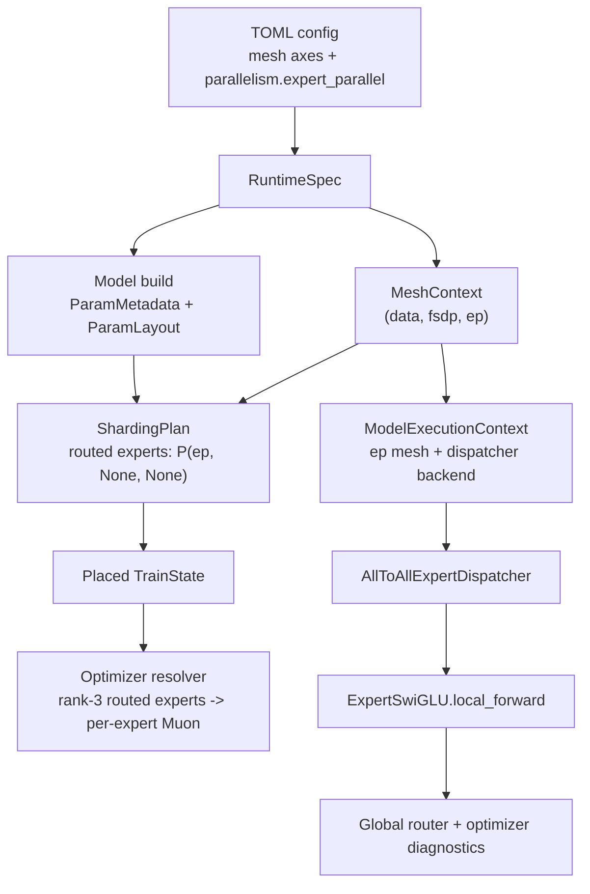

# MoE Expert Parallelism Design

This document describes Jaxtitan's expert parallelism architecture for Trinity-style MoE models. It is a design and implementation note, not a benchmark claim. The current implementation establishes the correctness boundary: explicit `ep` layout metadata, expert-axis routed weight placement, fixed-shape all-to-all token dispatch, per-expert Muon routing, checkpoint/resume compatibility, and local artifact diagnostics.

## Why This Matters

The realistic large-MoE target is a model with many total parameters and a much smaller active parameter count per token. That only works if routed experts are owned by different devices. Replicating every routed expert on every device wastes memory and blocks the intended scale point.

Jaxtitan already has:

- DDP, ZeRO-2, and FSDP for dense models.
- Trinity MoE blocks with routed experts, shared experts, AFMoE-style routing, SMEBU, sequence aux loss, z-loss, router diagnostics, and optimizer diagnostics.
- Muon for rank-2 hidden matrices, Dion2 for rank-2 sharded matrix routes, and per-expert Muon for rank-3 routed expert tensors when each per-expert matrix is complete locally.

The missing distributed piece is expert ownership plus token movement. Expert parallelism should make routed expert tensors sharded by expert axis, move token activations to the rank that owns each chosen expert, run local expert compute, then return and combine outputs.

## Reference Findings

### Papers

[GShard](https://arxiv.org/abs/2006.16668) is the original useful template for this stack: conditional MoE computation plus automatic sharding. The important lesson is that MoE scale is not just a layer implementation; it needs explicit sharding and collective movement to keep expert weights distributed while each token activates only a small subset.

[Switch Transformer](https://arxiv.org/abs/2101.03961) simplified routing to top-1 and made sparse MoE more stable. The relevant design lesson for Jaxtitan is not that we should use top-1; Trinity wants top-k. The lesson is that routing, capacity, load balance, and numerical stability are first-class training surfaces. EP cannot be a hidden optimization pass.

[GLaM](https://arxiv.org/abs/2112.06905) shows the value of top-2 sparse activation at large scale: more capacity at lower training cost than dense variants. That supports keeping Trinity's top-k path and designing dispatch for `top_k > 1`, not baking in a Switch-only top-1 special case.

[DeepSpeed-MoE](https://arxiv.org/abs/2201.05596) and later production stacks converge on the same pattern: token dispatch, expert-local compute, and token combine are the performance-critical MoE path. The model math is simple compared to the data movement.

### TorchTitan

The local TorchTitan reference shows the right component boundaries:

- `torchtitan/distributed/expert_parallel.py` shards every grouped expert parameter on axis `0`, the expert axis.
- `torchtitan/models/common/moe.py` stores experts as rank-3 tensors and runs grouped expert matmuls after dispatch:
  - `w1: [num_experts, hidden_dim, dim]`
  - `w2: [num_experts, dim, hidden_dim]`
  - `w3: [num_experts, hidden_dim, dim]`
- `torchtitan/models/common/token_dispatcher.py` has a local dispatcher for `ep=1` and an all-to-all dispatcher for `ep>1`.
- TorchTitan's all-to-all dispatcher sorts token assignments by expert, exchanges tokens by expert-owner rank, reorders rank-major data back into expert-major order, runs experts, then reverses the communication and scatter-adds outputs.
- TorchTitan has to convert expert DTensor parameters to local tensors inside expert compute because dynamic EP token shapes are awkward for PyTorch DTensor. That is a warning sign and an opportunity for Jaxtitan.

The key idea to copy is separation of concerns:

```text
model owns rank-3 expert tensors
parallelism owns expert-axis placement
dispatcher owns token movement
expert module owns grouped compute
optimizer resolves from actual parameter layout
```

### Megatron Core

Megatron Core's MoE docs describe the same production contract:

- Router choices include top-k, group top-k, sigmoid or softmax scoring, and multiple load-balancing strategies including aux loss, sequence aux loss, global aux loss, Sinkhorn, and bias-based aux-free balancing.
- Token dispatch is explicit: tokens are sent to the GPU hosting the selected expert, processed there, then returned and combined.
- Dispatcher choices include NCCL all-to-all for standard EP, allgather for small or TP-only cases, and FlexDispatcher backends such as DeepEP and HybridEP for optimized cross-node or fine-grained MoE communication.

Sources: [Megatron Core MoE README](https://github.com/NVIDIA/Megatron-LM/blob/main/megatron/core/transformer/moe/README.md) and [Megatron Core token dispatcher docs](https://docs.nvidia.com/megatron-core/developer-guide/latest/apidocs/core/core.transformer.moe.token_dispatcher.html).

The lesson for Jaxtitan is that all-to-all is the baseline, not the endpoint. We should start with a correct pure-JAX all-to-all dispatcher, then leave a backend slot for optimized dispatch later.

### MaxText

MaxText is the most relevant JAX reference. Its docs say EP shards both expert FFN weights and activations by the expert dimension, while the EP axis behaves like FSDP for attention and other non-expert work. It also calls out a practical load-balance point: if `EP = num_experts`, one hot expert can stall the whole MoE layer; using fewer EP shards than experts lets each rank own multiple experts and averages out imbalance.

MaxText also documents the performance space:

- dropless options through ragged/sparse matmul paths;
- capacity-limited dropping for bounded dense dispatch;
- a custom sort VJP to avoid inefficient scatter-add in backward;
- ring-of-experts as an experimental alternative that replaces two all-to-alls with all-gather plus reduce-scatter for large top-k settings;
- expert-dimension sharding over an FSDP-like axis when the expert count is divisible by the parallelism size.

Sources: [MaxText MoE configuration](https://maxtext.readthedocs.io/en/latest/reference/core_concepts/moe_configuration.html), [MaxText sharding guide](https://maxtext.readthedocs.io/en/latest/guides/optimization/sharding.html), and MaxText's JAX MoE source at [src/MaxText/layers/moe.py](https://raw.githubusercontent.com/AI-Hypercomputer/maxtext/main/src/MaxText/layers/moe.py).

The design lesson is to start with expert-axis sharding and fixed contracts, then add dropless/ragged or optimized kernels only after correctness and profiling are stable.

## JAX Advantage Over Torch Here

JAX gives us a cleaner path than a PyTorch DTensor-first design if we are disciplined about static shapes and layout metadata.

JAX supports a global-array programming model with explicit `Mesh`, `NamedSharding`, and `PartitionSpec`, plus manual SPMD through `shard_map`. The distributed arrays docs describe these as composable modes: global view with explicit sharding, compiler partitioning, and manual per-device collectives when needed. Sources: [JAX distributed arrays](https://docs.jax.dev/en/latest/notebooks/Distributed_arrays_and_automatic_parallelization.html), [JAX sharding API](https://docs.jax.dev/en/latest/jax.sharding.html), and [JAX shard_map](https://docs.jax.dev/en/latest/notebooks/shard_map.html).

That means Jaxtitan can keep the model and train step as PyTrees of global arrays while making sharding policy explicit and inspectable. Where the EP dispatcher needs rank-local logic, `shard_map` can express the per-device token exchange path with explicit collectives. `jax.lax.all_to_all` directly materializes a mapped axis and maps a different axis, which is exactly the fixed-shape dispatch operation we need. Source: [jax.lax.all_to_all](https://docs.jax.dev/en/latest/_autosummary/jax.lax.all_to_all.html).

The practical advantages:

- We can keep one pure-JAX reference path and one optimizer/checkpoint/runtime contract.
- We can avoid a hard split between distributed tensor wrappers and local tensors. TorchTitan's DTensor-to-local conversion for dynamic EP inputs is a sign of PyTorch friction; Jaxtitan can use static padded buckets and global array shardings instead.
- We can make shape and sharding failures compile-time or preflight failures, not silent fallback behavior.
- We can profile first, then replace only the hot subgraphs with Pallas or ThunderKittens kernels while preserving the JAX reference path. Pallas exists for JAX-native custom kernels, but it is still experimental and should not be the first correctness boundary. Source: [JAX Pallas](https://docs.jax.dev/en/latest/pallas/index.html).

The tradeoff is that JAX wants static shapes. We should embrace that instead of fighting it: first EP should use fixed-capacity padded token buckets, not ragged host split lists.

## Target Public Surface

Add one plain axis and keep mode names plain:

```toml
[mesh]
axis_names = ["data", "ep"]
axis_sizes = [2, 4]

[parallelism]
mode = "ddp"
expert_parallel = true
```

For FSDP plus EP:

```toml
[mesh]
axis_names = ["data", "fsdp", "ep"]
axis_sizes = [1, 2, 4]

[parallelism]
mode = "fsdp"
expert_parallel = true
```

The exact TOML shape can be refined, but the semantics should be:

- `data`: batch sharding.
- `fsdp`: dense parameter, dense optimizer, and dense gradient sharding.
- `ep`: routed expert ownership.
- `tp`: still reserved.

Do not overload `fsdp` to mean expert parallelism. EP deserves its own mesh axis because it changes activation movement, parameter ownership, optimizer semantics, diagnostics, and checkpoint compatibility.

## Implemented Architecture

The implementation follows the same separation used elsewhere in Jaxtitan: model components own parameter semantics, mesh/sharding owns layout, optimizer construction resolves backend policy from actual layout, and train/eval steps pass a runtime execution context without changing model public outputs.



### Config And Mesh

EP is explicit. A mesh may include `ep`, but Jaxtitan only uses it for routed expert ownership when `[parallelism].expert_parallel = true`. This avoids accidental behavior from an unused axis.

Supported first-slice combinations:

- `ddp + ep`: batch shards over `data`; routed experts shard over `ep`; dense parameters remain replicated.
- `fsdp + ep`: dense hidden matrices follow the existing FSDP policy; routed experts shard over `ep`.
- `zero2 + ep`: dense model parameters remain replicated while dense optimizer state can follow ZeRO-2 policy; routed experts still shard over `ep`.

Still rejected:

- `tp > 1`;
- `expert_parallel = true` without an `ep` mesh axis;
- `num_experts` not divisible by `ep` size;
- routed expert tensors that are not rank 3.

### Model Execution Context

Decoder and Trinity forward APIs accept an optional `ModelExecutionContext`. Dense decoder models ignore it. Trinity MoE blocks pass it into `SparseMoE`, which selects the dispatcher:

- no EP context: `LocalExpertDispatcher`;
- EP context with backend `all_to_all`: `AllToAllExpertDispatcher`;
- EP context with backend `psum`: retained correctness/reference dispatcher.

The training and eval step builders derive this context from the active `ShardingPlan`. This keeps model construction independent from runtime mesh placement and keeps old logits-only helpers working.

### Dispatcher Contract

`SparseMoE` still owns routing, shared experts, router stats, and aux-loss emission. The dispatcher owns only selected expert execution:

```text
hidden -> router -> expert_ids, weights
hidden, expert_ids, weights -> dispatcher -> routed_output
routed_output + shared_expert_output -> block output
```

The exact all-to-all dispatcher uses fixed static buckets:

1. Flatten `[batch, seq, top_k]` route assignments.
2. Partition source assignments by `assignment_index % ep_size`.
3. Bucket source assignments by expert-owner rank.
4. Exchange padded buckets with `jax.lax.all_to_all` inside `jax.shard_map`.
5. Run complete local expert matrices on the owning rank.
6. Reverse the all-to-all.
7. Scatter-add selected expert outputs back to token positions.
8. `psum` across `ep` to combine the source partitions.

This is intentionally a static, dropless correctness path. It is not expected to be the final fastest path, but it gives us one exact JAX reference implementation that can be profiled and replaced behind the same dispatcher boundary.

### Optimizer Semantics

The public optimizer knob remains `optimizer.name = "muon"`. Under EP, the resolved backend is layout-aware:

- routed rank-3 experts with expert-axis sharding use per-expert Muon;
- rank-2 replicated hidden matrices use Muon;
- rank-2 FSDP/ZeRO-sharded hidden matrices use Dion2;
- embeddings, LM head, norms, router, expert bias, vectors, scalars, and unknown leaves remain AdamW fallback.

This is the central reason routed experts are sharded by expert axis. Each rank owns complete per-expert matrices, so Muon is applied to the correct 2D object instead of to a flattened rank-3 tensor or a partial matrix shard.

### Artifact Contract

Diagnostics and resume compatibility record the resolved EP policy, including:

- `expert_parallel` enabled flag;
- `ep` axis size;
- experts per EP rank;
- dispatcher backend;
- capacity policy;
- token partition and combine policy;
- optimizer route backend counts.

Resume rejects changes that would alter expert ownership, dispatcher semantics, or resolved optimizer policy.

## Parameter Placement Policy

Recommended first policy:

| Parameter class | DDP + EP | FSDP/ZeRO-2 + EP |
| --- | --- | --- |
| embeddings | replicated | existing dense policy |
| attention matrices | replicated | existing dense policy |
| dense FFN matrices | replicated | existing dense policy |
| shared expert matrices | dense FFN policy | existing dense policy |
| router projection | replicated | replicated first, later configurable |
| expert bias | replicated or expert-axis sharded with global stats | replicated first for simpler SMEBU |
| routed expert rank-3 weights | `P("ep", None, None)` | `P("ep", None, None)` |

Routed experts should be sharded by expert axis, not matrix axis. This keeps each local expert matrix complete. That matters because Muon semantics are per 2D matrix, not per shard.

First version should require:

- `num_experts % ep_size == 0`;
- every routed expert tensor is rank 3;
- routed expert axis is axis 0;
- no tensor parallelism;
- no multi-host until host-side data and mesh initialization are explicitly designed.

Later we can allow `ep_size < num_experts` so each rank owns multiple experts. That is actually preferable for early training because it reduces straggler risk when routing is imbalanced.

## Dispatcher Design

Introduce a dispatcher boundary under the MoE component:

```text
SparseMoE
  router -> expert_ids, weights, router stats
  dispatcher.dispatch(hidden, expert_ids, weights)
  ExpertSwiGLU.local_forward(dispatched_tokens, local_expert_ids)
  dispatcher.combine(local_outputs)
  shared_experts(hidden)
```

Implementations:

- `LocalExpertDispatcher`: current behavior, no communication, used for `ep=1`, CPU tests, and reference parity.
- `AllToAllExpertDispatcher`: fixed-capacity expert buckets plus `lax.all_to_all`, used for `ep>1`.
- Later: `RaggedAllToAllExpertDispatcher`, `RingOfExpertsDispatcher`, or a kernel-backed dispatcher.

### Fixed-Capacity All-To-All Path

The first JAX-friendly all-to-all path should be static:

1. Router returns `expert_ids: [batch, seq, top_k]` and normalized `weights`.
2. Flatten to assignments `[tokens * top_k]`.
3. Compute `owner_rank = expert_id // experts_per_ep_rank`.
4. Build padded send buckets shaped approximately `[ep_size, capacity_per_rank, hidden]`.
5. Use `shard_map` over the `ep` axis and `lax.all_to_all` to move buckets to expert-owner ranks.
6. On each rank, remap global expert ids to local expert ids and run grouped local expert compute.
7. Reverse all-to-all to return selected outputs.
8. Scatter-add or segment-sum selected outputs back to `[batch, seq, hidden]`.
9. Add shared expert output locally.

This is not the fastest implementation, but it gives us exact semantics, static shapes, and a clean profiling target.

### Capacity Policy

First implementation should not silently drop tokens. Options:

- `capacity_factor = "strict_dropless"` using a worst-case capacity equal to local assignments. This is simple but memory-heavy.
- `capacity_factor = 1.25` with an explicit overflow error or explicit dropped-token metric. This is faster but changes training semantics.

Recommendation: implement a strict static dropless smoke policy first, then add capacity-limited routing as a separate slice. The first EP correctness run should not have hidden token drops.

JAX now also exposes `lax.ragged_all_to_all`, which may be useful after the fixed-shape implementation is validated. It should not be the first slice unless we prove it works cleanly with our gradient and checkpoint contracts.

## Optimizer Policy

Public optimizer intent stays:

```toml
[optimizer]
name = "muon"
```

Resolved backend policy:

- rank-2 replicated hidden matrices: Muon;
- rank-2 FSDP-sharded hidden matrices: Dion2;
- rank-3 routed expert tensors with expert-axis sharding: per-expert Muon;
- rank-3 routed expert tensors with matrix-axis sharding: reject Muon until a distributed expert-matrix optimizer is explicitly implemented;
- router, expert bias, embeddings, lm head, norms, vectors, and scalars: AdamW fallback.

This is a major reason to prefer expert-axis EP before any matrix-axis sharding of routed experts. Expert-axis EP scales routed expert memory while keeping exact per-expert Muon local.

Optimizer diagnostics should report route counts like:

```json
{
  "adamw": 42,
  "muon": 32,
  "dion2": 28
}
```

and route reasons such as:

- `expert_axis_sharded_full_matrices`;
- `fsdp_sharded_optimizer_state`;
- `expert_bias`;
- `norm`;
- `lm_head`;
- `embedding`.

Resume compatibility must fingerprint the resolved optimizer policy, not just `optimizer.name`.

## Metrics And Diagnostics

EP must extend the existing local artifact model:

- Router counts and importance must aggregate globally across `data` and `ep`.
- `moe_router_layers` should include local and global expert load summaries.
- Optimizer groups should include routed expert groups with backend `muon` when expert-axis sharded.
- Diagnostics should record:
  - `parallelism.expert_parallel = true`;
  - `mesh.ep_size`;
  - `experts_per_ep_rank`;
  - dispatcher backend;
  - capacity policy;
  - token drop or overflow counts;
  - all-to-all token counts by source and destination rank, at least in debug metrics.

Console output should stay minimal. The JSON artifacts and `run inspect` should be the visibility surface.

## Checkpoint And Resume

Checkpoints should store global arrays with sharding-aware restore templates, as current FSDP/ZeRO-2 already do.

Resume compatibility must reject changes to:

- `ep` axis presence or size;
- expert count;
- top-k;
- routed expert intermediate size;
- routed expert layout policy;
- dispatcher backend;
- capacity policy;
- optimizer resolved backend policy;
- SMEBU/balance constants.

It is acceptable for local artifact paths to differ. It is not acceptable for expert ownership to differ silently.

## Implementation Status And Stages

### Stage 1: Config, Mesh, And Layout Contract

Goal: make EP representable without changing model behavior.

Status: implemented.

Tasks:

- Add `ep` to supported mesh axes.
- Add `expert_parallel` or equivalent to `ParallelismSpec`.
- Extend `ShardingPlan` with expert parameter shardings.
- Mark routed expert layouts as expert-axis shardable.
- Validate `num_experts % ep_size == 0`.
- Keep `tp > 1` rejected.

Tests:

- config loads for `ddp + ep` and `fsdp + ep`;
- bad `ep` axis or non-divisible expert count fails;
- routed expert weights map to `PartitionSpec("ep", None, None)`;
- dense/shared/router/bias placements match policy;
- no runtime behavior changes when `ep=1`.

### Stage 2: Dispatcher Boundary With Local Reference

Goal: split routing from expert execution without communication yet.

Status: implemented.

Tasks:

- Introduce `ExpertDispatcher` protocol.
- Move current selected-expert gather/scatter path behind `LocalExpertDispatcher`.
- Keep `SparseMoE.__call__` and `forward_with_output` output contracts unchanged.

Tests:

- local dispatcher output equals current `ExpertSwiGLU` output;
- router stats and aux losses are unchanged;
- train, eval, prefill, decode, remat, donation, and gradient accumulation still pass.

### Stage 3: Fixed-Capacity All-To-All EP

Goal: first real EP implementation.

Status: implemented as the pure-JAX correctness backend.

Tasks:

- Implement static bucket construction and reverse combine in pure JAX.
- Use `shard_map` plus `lax.all_to_all` over the `ep` mesh axis.
- Start with strict static dropless behavior.
- Keep batch sharding on `data`.

Tests:

- local vs EP equivalence on CPU fake devices with deterministic routing;
- all-to-all token counts match hand-computed expected values;
- global router stats match local reference;
- gradients are finite and shape-preserving;
- one tiny compiled train step works with `ep > 1`.

### Stage 4: Optimizer, Checkpoint, And Runtime Integration

Goal: make EP trainable and resumable.

Status: implemented for train/eval/preflight/runtime diagnostics/resume compatibility.

Tasks:

- Place routed expert model leaves with expert-axis sharding.
- Initialize optimizer state from the placed expert-axis model state.
- Ensure rank-3 routed experts resolve to per-expert Muon, not AdamW.
- Save/restore sharded expert model and optimizer state through Orbax.
- Extend diagnostics, final summary, `run inspect`, and resume fingerprint.

Tests:

- checkpoint/restore continues one train step deterministically;
- resume accepts identical EP config and rejects incompatible EP changes;
- optimizer health reports routed expert Muon groups;
- eval and sample restore from EP checkpoints.

### Stage 5: FSDP/ZeRO-2 Plus EP

Goal: support the practical large-MoE mesh.

Status: implemented at the policy and smoke-test level; cloud-scale profiling remains the next validation step.

Tasks:

- Compose `data`, `fsdp`, and `ep` policies.
- Keep dense state under FSDP/ZeRO-2 policies.
- Keep routed experts under expert-axis EP.
- Decide whether shared experts are dense or expert-owned per architecture.
- Ensure global metrics across all axes.

Tests:

- `fsdp + ep + adamw` train step;
- `fsdp + ep + muon` train step with per-expert Muon for routed experts and Dion2 for dense FSDP-sharded hidden matrices;
- checkpoint/eval/sample/inspect all pass.

### Stage 6: Performance Work

Goal: optimize only after correctness is stable.

Status: next major work.

Tasks:

- Run train-only profiles for EP smoke configs.
- Optimize bucket construction, sorting, scatter-add, and grouped expert matmul.
- Consider `lax.ragged_all_to_all`, Pallas, ThunderKittens, or a DeepEP-like backend only behind the dispatcher boundary.
- Add optional overlap of shared experts with communication after baseline profiling.

Tests:

- every accelerated backend compares to the pure-JAX dispatcher;
- every performance claim has local profile artifacts and run summaries.

## Next Work

Do not start by replacing the dispatcher with kernels. The pure-JAX all-to-all path is now the semantic reference, so the next work should be:

1. Run multi-GPU cloud smokes for `ddp + ep`, `fsdp + ep`, and `fsdp + ep + muon`.
2. Capture train-only profiles with eval/checkpoint outside the trace window.
3. Identify whether the current bottleneck is bucket construction, all-to-all, scatter-add, grouped expert matmul, or per-expert Muon.
4. Replace only the measured hot subgraph behind the dispatcher or optimizer backend boundary.
5. Keep the pure-JAX path as the correctness oracle.

## Open Questions

- Should `expert_bias` remain replicated with a global SMEBU update, or should it be expert-axis sharded and all-gathered for routing? Replicated is simpler for the first implementation; sharded is more scalable for very large expert counts.
- Should router projection be replicated or FSDP-sharded under `fsdp + ep`? Replicated is simpler and probably fine initially.
- Should first performance EP use strict worst-case capacity or a capacity factor with explicit token dropping? Strict dropless is the current correctness policy; capacity-limited dispatch is a later training-policy decision.
- Should EP be enabled by `parallelism.expert_parallel = true` or by the presence of an `ep` mesh axis? Prefer both: require the explicit flag and reject unused `ep` axes to avoid accidental behavior.
- Should Ring-of-Experts be considered early? No. It is interesting for large top-k and communication reduction, but a standard all-to-all baseline is the reproducibility boundary.

## Source List

- [GShard: Scaling Giant Models with Conditional Computation and Automatic Sharding](https://arxiv.org/abs/2006.16668)
- [Switch Transformers: Scaling to Trillion Parameter Models with Simple and Efficient Sparsity](https://arxiv.org/abs/2101.03961)
- [GLaM: Efficient Scaling of Language Models with Mixture-of-Experts](https://arxiv.org/abs/2112.06905)
- [DeepSpeed-MoE: Advancing Mixture-of-Experts Inference and Training](https://arxiv.org/abs/2201.05596)
- [Megatron Core MoE README](https://github.com/NVIDIA/Megatron-LM/blob/main/megatron/core/transformer/moe/README.md)
- [Megatron Core token dispatcher docs](https://docs.nvidia.com/megatron-core/developer-guide/latest/apidocs/core/core.transformer.moe.token_dispatcher.html)
- [MaxText MoE configuration](https://maxtext.readthedocs.io/en/latest/reference/core_concepts/moe_configuration.html)
- [MaxText sharding guide](https://maxtext.readthedocs.io/en/latest/guides/optimization/sharding.html)
- [MaxText MoE source](https://raw.githubusercontent.com/AI-Hypercomputer/maxtext/main/src/MaxText/layers/moe.py)
- [JAX distributed arrays and automatic parallelization](https://docs.jax.dev/en/latest/notebooks/Distributed_arrays_and_automatic_parallelization.html)
- [JAX shard_map](https://docs.jax.dev/en/latest/notebooks/shard_map.html)
- [jax.lax.all_to_all](https://docs.jax.dev/en/latest/_autosummary/jax.lax.all_to_all.html)
- [JAX Pallas](https://docs.jax.dev/en/latest/pallas/index.html)
- TorchTitan source areas referenced:
  - `torchtitan/distributed/expert_parallel.py`
  - `torchtitan/models/common/moe.py`
  - `torchtitan/models/common/token_dispatcher.py`
